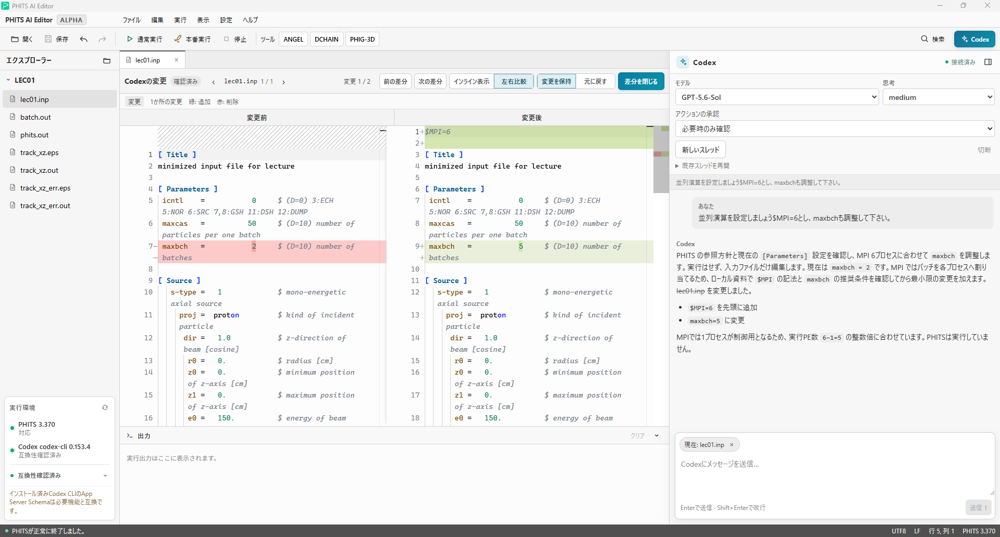
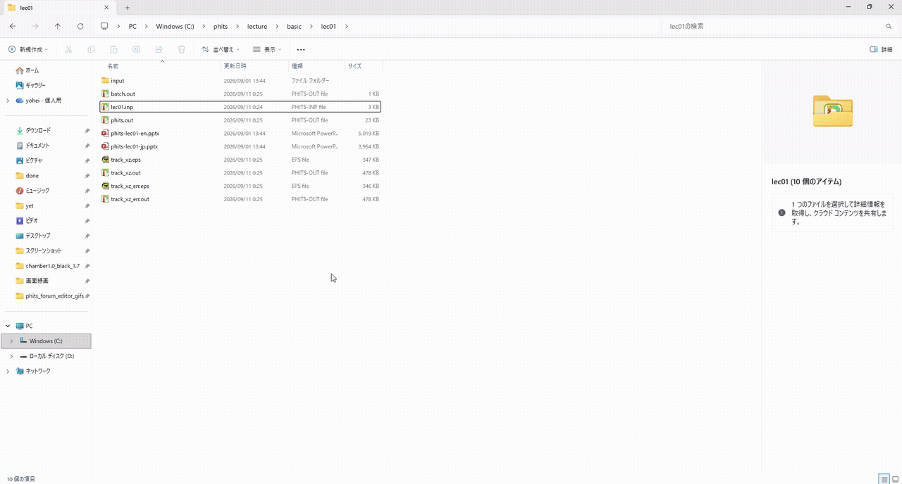

# PHITS AI Editor

[日本語](README.md) | English

A Windows editor that combines PHITS-Pad-style editing and execution with
Codex-assisted input editing in one interface.

## Download for Windows

The first alpha release supports Windows 11 x64.

- **Regular use (recommended):**
  [Download the installer](https://github.com/y-ozawa039/phits-ai-editor/releases/download/v0.0.2-alpha/PHITS-AI-Editor-v0.0.2-alpha-windows-x64-setup.exe)
- **Evaluation, portable use, or comparing versions:**
  [Download the portable ZIP](https://github.com/y-ozawa039/phits-ai-editor/releases/download/v0.0.2-alpha/PHITS-AI-Editor-v0.0.2-alpha-windows-x64-portable.zip)
- **Verify after downloading:**
  [SHA-256 checksums](https://github.com/y-ozawa039/phits-ai-editor/releases/download/v0.0.2-alpha/SHA256SUMS.txt)

| Purpose | Choose | Why |
|---|---|---|
| Edit PHITS inputs regularly | Installer | Adds Start menu and uninstall entries and registers `.inp`/`.pht` associations. It is the best choice for opening inputs directly from Explorer. |
| Try the editor first | Portable ZIP | No installation is required. Extract the entire ZIP to a folder and run `phits-ai-editor.exe`. |
| Compare multiple versions or carry it on removable storage | Portable ZIP | Extract each version to a separate folder without registering additional Windows applications. |
| Customize or develop the source with generative AI or other tools | Source code | Intended for development. It cannot be launched as downloaded and must be built using Node.js, pnpm, Rust, and the other development prerequisites. |

> **Important:** GitHub's automatically generated `Source code (zip)` and
> `Source code (tar.gz)` are not the portable Windows application. A ZIP that
> contains `index.html` after extraction is the source archive. To run the
> editor, select the installer or portable ZIP linked above.

See the [installation and first-run guide](docs/installation.en.md) for details
about setup, updates, uninstalling, SmartScreen, and SHA-256 verification.

PHITS and Codex CLI are not bundled. You can launch the editor without a PHITS
configuration when editing only. Codex CLI is required only for AI assistance.

## Interface and workflow demo

PHITS input editing, Codex conversations, and review of changes proposed by
Codex are available in one workspace.

The following demo shows the workflow from asking Codex about the opened PHITS
input through applying the resulting edit in the editor.

## Before using AI assistance

Before first use, follow the official PHITS AI-agent setup in
`<PHITSPATH>\workbench\README-jp.docx` so Codex can find the local PHITS manuals
and safety notes. After installing and signing in to Codex CLI, ask Codex:

> Prepare your environment to run PHITS. Read
> workbench/execution_setup_for_agent.md under the directory identified by the
> PHITSPATH environment variable, and follow its instructions.

Confirm that the setup finishes with
`Setup AI agent environment to PHITS is successfully finished.` before
connecting from PHITS AI Editor.

Using the configured PHITS root, the editor checks the PHITS AI setup and the
`AGENTS.md` or `AGENTS.override.md` files used by Codex. If it finds a problem,
you can expand **Files checked and reasons** and generate or copy an **AI
troubleshooting prompt** containing the diagnostic result. If the editor cannot
connect to Codex, paste that prompt into a local Codex task in ChatGPT desktop.
The check does not block Codex connection or chat, modify configuration files,
or send the prompt automatically. See [installation and first-run setup](docs/installation.en.md)
for the detailed checks and troubleshooting steps.

## System requirements

- Windows 11 x64 (distribution target for `0.0.2-alpha`)
- A PHITS runtime environment when running input files (automatically detected
  from `PHITSPATH` or selected in Settings)
- Codex CLI 0.153.1 or later when using AI assistance

PHITS, Codex CLI, credentials, and PHITS language assets are not included.

## Developing from source

See the [build instructions](docs/building.en.md) and
[release procedure](docs/releasing.md) for source builds, verification, and
distribution packaging. Before adapting the editor with generative AI, also
review the [AI customization guide](docs/customizing-with-ai.en.md),
[architecture](ARCHITECTURE.en.md), and
[safety boundaries](docs/safety-boundaries.en.md).

## License and citation

PHITS AI Editor is released under the [Apache License 2.0](LICENSE). See
[AUTHORS.md](AUTHORS.md) for author and researcher identifiers, and
[CITATION.cff](CITATION.cff) for machine-readable citation metadata. The
dependency inventory is in [THIRD_PARTY_NOTICES.md](THIRD_PARTY_NOTICES.md),
and the license, copyright, and NOTICE texts included with the distribution
are in [THIRD_PARTY_LICENSES.txt](THIRD_PARTY_LICENSES.txt). See
[TRADEMARKS.md](TRADEMARKS.en.md) for name, original-logo, and modified-build
display policies, and [SECURITY.md](SECURITY.en.md) for private vulnerability
reporting.

Citation is not a condition of ordinary use. If PHITS AI Editor makes a
substantial contribution to published research, an optional acknowledgment or
citation using `CITATION.cff` is welcome.

This is an independent personal project. It does not imply development,
approval, or warranty by the author's affiliated institution. PHITS and Codex
CLI are separate products, are not included in this repository or its
distributions, and must be obtained from their official providers under their
own terms.

The project is published as a customizable alpha foundation for people who
want to adapt an editor with generative AI or other tools. It primarily targets
users who can inspect logs and source and perform their own investigation,
workaround, and recovery. Individual support and response times are not
guaranteed. See [CONTRIBUTING.md](CONTRIBUTING.en.md) for the Issue and Pull
Request policy.

`PHITS AI Editor` and the green P logo are provisional alpha names and marks.
This is not an official product developed, approved, sponsored, endorsed, or
warranted by JAEA, the PHITS development team, OpenAI, or the author's
affiliated institution.

## Windows alpha release (`0.0.2-alpha`)

Implemented features include:

- multi-tab editing, search and replace, Undo/Redo, new file, Save, and Save As
- direct `.inp`/`.pht` opening from Explorer or drag-and-drop, forwarding to an
  already-open window, and restoration of the previous workspace and tabs
- show/hide controls for Explorer, Codex, and Output panels, with saved font
  sizes and Codex panel width
- preservation of UTF-8, UTF-8 BOM, Windows-31J, CRLF, and LF; safe replacement
  of saved files and a backup of the previous version
- PHITS syntax highlighting, completion, and descriptions for supported fields
- normal PHITS execution and a calculation-priority mode that closes the editor
  and Codex to free resources for the calculation
- safe selection of exactly one run target and prevention of duplicate runs
  when a workspace contains multiple input files
- integration with ANGEL, DCHAIN, and PHIG-3D
- Codex chat, thread resume/rename/delete, model selection, and compatibility
  status for available features
- Codex editing assistance using the current file, selection, and unsaved text,
  with configurable approval behavior
- full diff review of Codex changes, change navigation, inline/side-by-side
  views, and controls to keep or revert changes
- reload and conflict protection after Codex edits, with Undo/Redo support

## Limitations and verification status

The distribution is not code-signed, so Windows SmartScreen may show a warning
during installation.

Installation, file editing and execution, Codex editing assistance, diff review,
Undo/Redo, and uninstallation were tested on the Windows 11 x64 development
environment and a separate PC. PHIG-3D integration was verified only on the
development environment. See the
[Windows alpha test report](docs/windows-alpha-test-report.md) for details.
Ubuntu support and Linux packages are possible future ports and are not
currently available.

See the [release notes](docs/release-notes-v0.0.2-alpha.en.md) and
[known issues](docs/known-issues-v0.0.2-alpha.en.md).
